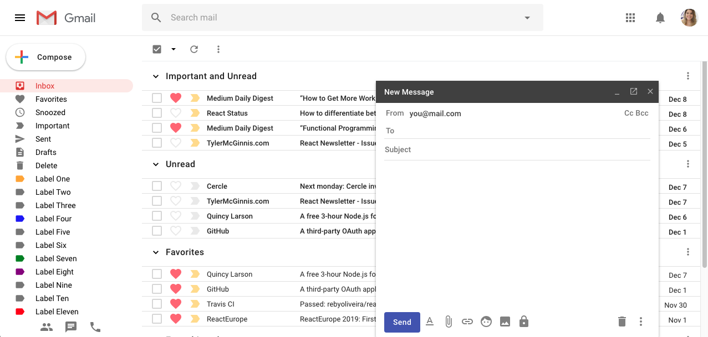

# Xmail - A Gmail Clone

## Main Objective

Google is a reference in design and high technologies.

With this in mind, the main idea of this project is to recreate a Gmail, applying in a single project Material UI, JSS, React, React Router and Redux, with responsive design, to learn/practice all this technologies and frameworks together.

## Roadmap - v0.1.0

To replicate the design of Gmail using Material UI/JSS. After implement the screens using just React and JSS, next step is to add more interaction (UX), and replicate some email management features using just Redux.

The steps that are finished, has the screenshot on next section

- [x] Mail list view - Index list / Favorites / Snoozed / etc
- [x] Compose email
- [x] Opened email
- [x] Reply email
- [ ] Hamburger menu to control the drawer
- [ ] Compose a "real" email, with "to" emails suggestions
- [ ] Send bar being able to send, delete and draft an email
- [ ] Toolbar in mail list being able to archive, read, delete and snooze
- [ ] Improve code coverage, and build on Travis
- [ ] Split into small reusable components

### Mail list view

### Compose email

### Opened email

### Reply email

### Tecnologies

[Material UI](https://material-ui.com/)

[JSS](https://cssinjs.org/)

[React](https://reactjs.org/)

[React Router](https://reacttraining.com/react-router/)

[Redux](https://redux.js.org/)

[Github](https://github.com/)

### Disclaimer

#### This project was created with the only proposal for studies and practice coding skills, never to create a copy of Google products as a business.

##### All rights of Gmail or any [Google](https://www.google.com/) products belongs to [Alphabet Inc.](https://abc.xyz/)
