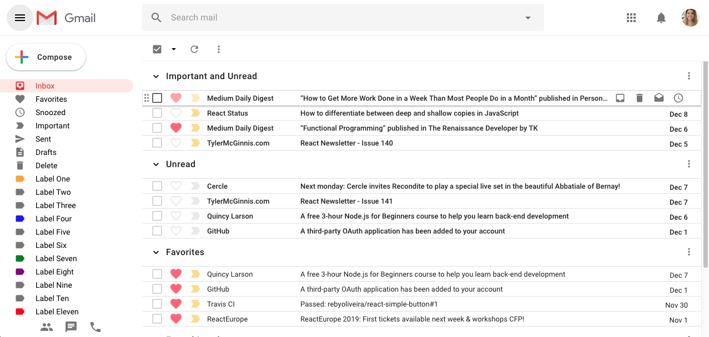
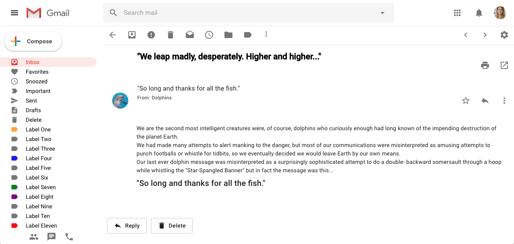

## Xmail - A Gmail clone:

***

## Main Objective

Google is a reference in design and hight technologies.

Thinking of this, the idea of this project is to recreate a Gmail, applying in a single project Material UI, JSS, React, React Router and Redux, with responsive design, to learn/practice all this technologies and frameworks together.

### Roadmap - v.0.1

###### HTML and CSS: To replicate the design of Gmail using Material UI/JSS.

- [x]  Mail list view - Index list / Favorites / Snoozed...etc. (img. 1)

- [x]  Compose email (img. 2)

- [x]  Opened email (img.3)

- [x]  Reply mail (img.3)

**Img. 01**

**Img. 02**

**Img. 03**

###### JS: To use React, React Router and Redux to create an integration between interface and user.

- [ ]  Hamburger menu with drawer effects
- [ ]  Click on 'Compose' button and open a window for new email  
    - [ ]  Toolbar actions (minimize / maximize / close window)
    - [ ]  To include some previous email for 'to' field, to user select
    - [ ]  To include subject
    - [ ]  To include text content field
    - [ ]  Actions in 'send bar'
      - [ ]  Include some text editor for edit text area
      - [ ]  'Send' button, to send email    
      - [ ]  'Delete' button, to exclude email
      - [ ]  Save in Draft when close the window
    - [ ]  After 'Send' email appears on 'Sent' list
    - [ ]  Aborted email appears on 'Draft' list
    - [ ]  Inbox appear an email model  
      - [ ]  Actions directly in email list (archive, snooze,favorite...etc)
      - [ ]  Open email
        - [ ]  Toolbar in email for actions (archive, snooze,favorite...etc)
        - [ ]  Actions in button 'Reply'
      - [ ]  Open box 'Reply'
          - [ ]  The same actions used in 'Compose' process.
- [ ]  To write and run a test for every new feature
- [ ]  Split into small reusable components and publish a package on NPM

### Disclaimer

##### This project was created with the only proposal for studies and coding trainee, never to create a copy of Google products as a business.

###### All rights of Gmail or any [Google](goole.com) products belongs to [Alphabet Inc.](https://abc.xyz/)

### Tecnologies

[Material UI](material-ui.com)

[JSS](cssinjs.org)

[React](reactjs.org)

[React Router](reacttraining.com/react-router/)

[Redux](redux.js.org)

[Github](github.com)
